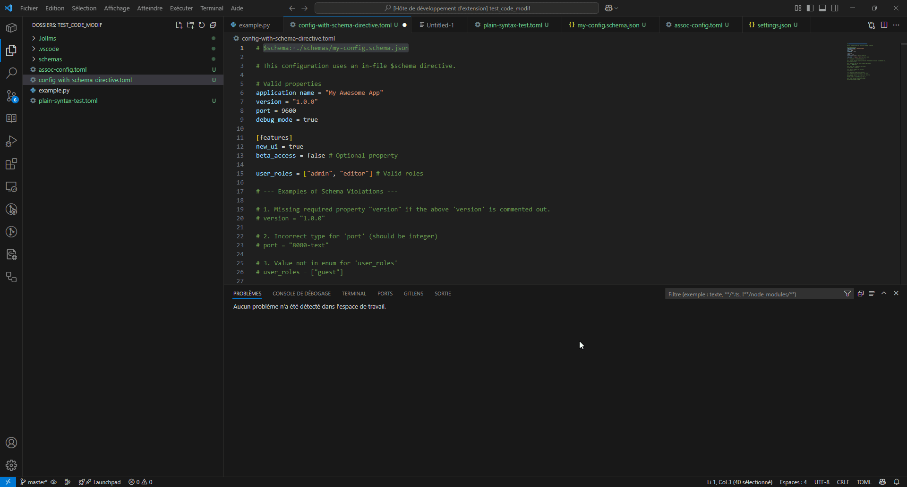

# TOML Highlighting, Validation, Schema & Autocompletion for VS Code

[](https://marketplace.visualstudio.com/items?itemName=ParisNeo.toml-hilighter)
[](https://marketplace.visualstudio.com/items?itemName=ParisNeo.toml-hilighter)
[](https://marketplace.visualstudio.com/items?itemName=ParisNeo.toml-hilighter)

Comprehensive syntax highlighting, **TOML v1.0.0 syntax validation**, **JSON Schema based validation**, and **schema-aware autocompletion** for TOML (Tom's Obvious, Minimal Language) files in Visual Studio Code.




This extension provides detailed syntax highlighting for all TOML v1.0.0 features, adds real-time TOML syntax validation, introduces JSON Schema based validation, and offers schema-driven autocompletion to make your configuration files easier to read, write, and debug.

## Features

*   **Full TOML v1.0.0 Syntax Highlighting:** Covers all TOML data types and structures.
*   **Real-time TOML Syntax Validation:** Catches TOML syntax errors as you type, powered by [`@ltd/j-toml`](https://github.com/LongTengDao/j-toml).
*   **JSON Schema Validation:**
    *   Validates TOML documents against specified JSON Schemas for structural and content correctness.
    *   Associate schemas via `# $schema:` comments or `toml.schema.associations` setting.
    *   Supports local and remote (HTTP/HTTPS) schemas.
    *   Includes schema caching and a "TOML Schemas" output channel for diagnostics.
*   **JSON Schema-based Autocompletion (MVP):**
    *   Suggests TOML keys based on `properties` in the associated schema.
    *   Provides autocompletion for `enum` values.
    *   Suggests `true` and `false` for boolean types.
    *   Displays schema `description` and `type` for completion items.
    *   Context-aware suggestions (initial implementation focuses on current table scope and key prefixes).
*   **Comments, Operators, Structure:** Clear highlighting and scoping.
*   **Language Configuration:** Bracket matching, auto-closing, commenting (`#`).
*   **Customizable Colors:** Via TextMate scopes in `settings.json`.

## Installation

1.  Open **Visual Studio Code**.
2.  Go to the **Extensions** view (`Ctrl+Shift+X` or `Cmd+Shift+X`).
3.  Search for `TOML Highlighting ParisNeo`.
4.  Click **Install**.
5.  Reload VS Code if prompted.

Alternatively, install via the command line:
```bash
code --install-extension ParisNeo.toml-hilighter
```

## Usage

The extension automatically activates for `.toml` files.

*   **Syntax Highlighting:** Applied immediately.
*   **Syntax Validation:** Errors appear in the "Problems" panel.
*   **Schema Validation:** If a schema is associated (see below), violations are reported in "Problems".
*   **Autocompletion:** Triggered as you type or by pressing `Ctrl+Space` (or your configured keybinding). Suggestions for keys and values (enums, booleans) will appear if a schema is active and relevant.

### Associating JSON Schemas

(This section remains the same as before, explaining `$schema` comment and `toml.schema.associations`)

You can associate a JSON schema with your TOML files in two ways:

1.  **In-file `$schema` comment (Recommended for project-specific schemas):**
    Add a comment at the top of your TOML file:
    ```toml
    # $schema: ./path/to/your/schema.json
    # or
    # $schema: https://example.com/remote/schema.json

    title = "My TOML Configuration"
    # ... rest of your TOML content
    ```
    Relative paths are resolved against the location of the TOML file. This method takes precedence over settings-based associations.

2.  **VS Code Settings (`toml.schema.associations`):**
    Configure associations in your `settings.json` (`Ctrl+,` or `Cmd+,`):
    ```json
    "toml.schema.associations": {
        "**/my-project-config.toml": "./schemas/project-specific.json",
        "**/another-pattern/*.toml": "https://json.schemastore.org/cargo",
        "/Users/me/global_configs/**/conf.toml": "/absolute/path/to/global_schema.json"
    }
    ```
    The key is a glob pattern that matches TOML file paths, and the value is the schema URI (local path relative to the workspace root, absolute path, or an HTTPS URL).

### Schema Validation & Autocompletion Notes

*   Both schema validation and autocompletion require a successfully parsed TOML document (no syntax errors).
*   **Validation Errors:** For the initial implementation, schema validation errors are typically placed on the line of the `# $schema` comment or the first line of the document. The diagnostic message will contain the `instancePath` (TOML path) and the error message from `ajv`.
*   **Autocompletion Context:** The current autocompletion is an MVP. It primarily understands the current table context (e.g., keys within `[table.name]`) and simple key prefixes. More complex TOML structures for context detection (like inline tables or deeply nested keys defined non-sequentially) will be improved in future versions.
*   The "TOML Schemas" output channel (`View > Output`, then select "TOML Schemas" from the dropdown) provides logs related to schema loading, validation, and completion activity.

## Configuration

This extension offers the following settings (accessible via `settings.json`):

*   `toml.schema.enableValidation` (boolean, default: `true`):
    Enable or disable JSON Schema validation for TOML files.
*   `toml.schema.enableCompletions` (boolean, default: `true`):
    Enable or disable JSON Schema-based autocompletion for TOML files.
*   `toml.schema.associations` (object, default: `{}`):
    Associate TOML files matching glob patterns with JSON Schemas.
    Example: `{ "**/mypackage.toml": "./schemas/mypackage.schema.json" }`
*   `toml.schema.cache.maxSize` (integer, default: `20`):
    Maximum number of compiled schemas to keep in the cache. Set to `0` to disable caching (not recommended for remote schemas).

## Customization (Highlighting)

(This section remains the same as before)

You can customize the syntax highlighting colors by targeting the TextMate scopes used in this extension within your VS Code `settings.json`. The default customizations provide examples:

```json
"editor.tokenColorCustomizations": {
    "[toml]": { // Apply only to TOML files
        "textMateRules": [
            {
                "name": "TOML Sections (User Override)",
                "scope": [
                    "entity.name.section.table.toml",
                    "entity.name.section.array.table.toml",
                    "punctuation.definition.table.begin.toml",
                    "punctuation.definition.table.end.toml",
                    "punctuation.definition.table.array.begin.toml",
                    "punctuation.definition.table.array.end.toml",
                    "entity.name.section.key.quoted.toml"
                 ],
                "settings": {
                    "foreground": "#C586C0"
                }
            },
            {
                "name": "TOML Keys (User Override)",
                "scope": [
                   "variable.other.key.toml"
                ],
                "settings": {
                   "foreground": "#9CDCFE"
                }
            }
        ]
    }
}
```

Refer to the `syntaxes/toml.tmLanguage.json` file for a full list of scopes.

## Dependencies

*   [`@ltd/j-toml`](https://github.com/LongTengDao/j-toml): For parsing and validating TOML syntax.
*   [`ajv`](https://ajv.js.org/): For JSON Schema validation.
*   [`ajv-formats`](https://github.com/ajv-validator/ajv-formats): For additional format validation in Ajv.

These dependencies are bundled with the extension.

## Contributing

Contributions, issues, and feature requests are welcome! Please check the [repository issues](https://github.com/ParisNeo/toml_hilighter/issues) page.

## License

This extension is licensed under the [MIT License](LICENSE).

---

**Enjoy clearer, more correct, well-structured, and intelligently completed TOML files!**