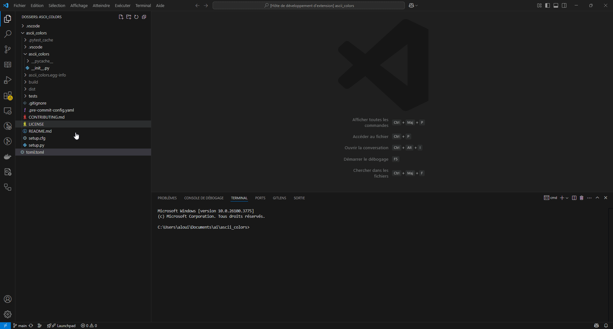

# TOML Highlighting for VS Code

[](https://marketplace.visualstudio.com/items?itemName=ParisNeo.toml-hilighter)
[](https://marketplace.visualstudio.com/items?itemName=ParisNeo.toml-hilighter)
[](https://marketplace.visualstudio.com/items?itemName=ParisNeo.toml-hilighter)

Comprehensive and accurate syntax highlighting for TOML (Tom's Obvious, Minimal Language) files in Visual Studio Code.


*(Animation placeholder - You need to create `images/demo.gif`)*

This extension provides detailed syntax highlighting for all TOML v1.0.0 features, making your configuration files easier to read and edit.

## Features

*   **Full TOML v1.0.0 Syntax:** Highlights keys (bare, quoted), strings (basic, multiline, literal), integers (decimal, hex, octal, binary), floats (including inf/nan), booleans, dates and times (offset, local), arrays, inline tables, standard tables, and arrays of tables.
*   **Comments:** Clear highlighting for comments.
*   **Operators:** Distinguishes the assignment operator (`=`).
*   **Structure:** Properly scopes tables (`[...]`), arrays of tables (`[[...]]`), arrays (`[...]`), and inline tables (`{...}`).
*   **Language Configuration:** Includes bracket matching, auto-closing pairs, commenting (`#`), and word patterns suitable for TOML.
*   **Color Theme Integration:** Uses standard TextMate scopes for compatibility with most VS Code color themes.
*   **Customizable Colors:** Provides default color overrides for table headers and keys, easily adjustable in your `settings.json` (see `package.json` `configurationDefaults`).

## Installation

1.  Open **Visual Studio Code**.
2.  Go to the **Extensions** view (`Ctrl+Shift+X` or `Cmd+Shift+X`).
3.  Search for `TOML Highlighting ParisNeo`.
4.  Click **Install**.
5.  Reload VS Code if prompted.

Alternatively, install via the command line:
```bash
code --install-extension ParisNeo.toml-hilighter
```

## Usage

The extension automatically activates when you open a file with the `.toml` or `.pip` extension.

## Customization

You can customize the syntax highlighting colors by targeting the TextMate scopes used in this extension within your VS Code `settings.json`. The default customizations provide examples:

```json
"editor.tokenColorCustomizations": {
    "[toml]": { // Apply only to TOML files
        "textMateRules": [
            {
                "name": "TOML Sections (User Override)",
                "scope": [
                    "meta.tag.table.toml entity.name.section.key",
                    "meta.tag.array.table.toml entity.name.section.key",
                    "punctuation.definition.table.begin.toml",
                    "punctuation.definition.table.end.toml",
                    "punctuation.definition.table.array.begin.toml",
                    "punctuation.definition.table.array.end.toml"
                 ],
                "settings": {
                    "foreground": "#C586C0" // Example: Change table headers to pink
                }
            },
            {
                "name": "TOML Keys (User Override)",
                "scope": [
                   "meta.key-value.pair.toml variable.other.key.toml",
                   "meta.key-value.pair.toml string.quoted.double.key.toml",
                   "meta.key-value.pair.toml string.quoted.single.key.toml"
                ],
                "settings": {
                   "foreground": "#9CDCFE" // Example: Change keys to light blue
                }
            }
            // Add more rules here to customize other scopes...
        ]
    }
}
```

Refer to the `syntaxes/toml.tmLanguage.json` file for a full list of scopes used.

## Contributing

Contributions, issues, and feature requests are welcome! Please check the [repository issues](https://github.com/ParisNeo/toml-hilighter/issues) page. (**<-- UPDATE LINK if needed**)

## License

This extension is licensed under the [MIT License](LICENSE).
